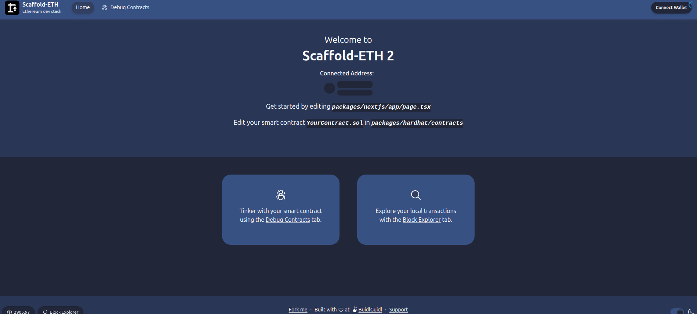
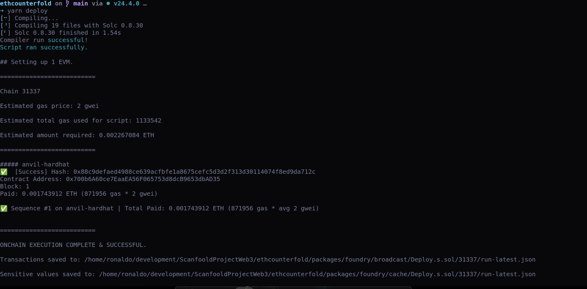

# 🏗 Scaffold-ETH 2

<h4 align="center">
  <a href="https://docs.scaffoldeth.io">Documentation</a> |
  <a href="https://scaffoldeth.io">Website</a>
</h4>

## Requirements

Before you begin, you need to install the following tools:

- [Node (>= v20.18.3)](https://nodejs.org/en/download/)
- Yarn ([v1](https://classic.yarnpkg.com/en/docs/install/) or [v2+](https://yarnpkg.com/getting-started/install))
- [Git](https://git-scm.com/downloads)

## Quickstart

To get started with Scaffold-ETH 2, follow the steps below:

1. Install dependencies if it was skipped in CLI:

```
cd my-dapp-example
yarn install
```

2. Run a local network in the first terminal:

```
yarn chain
```

This command starts a local Ethereum network using Foundry. The network runs on your local machine and can be used for testing and development. You can customize the network configuration in `packages/foundry/foundry.toml`.

3. On a second terminal, deploy the test contract:

```
yarn deploy
```

This command deploys a test smart contract to the local network. The contract is located in `packages/foundry/contracts` and can be modified to suit your needs. The `yarn deploy` command uses the deploy script located in `packages/foundry/script` to deploy the contract to the network. You can also customize the deploy script.

4. On a third terminal, start your NextJS app:

```
yarn start
```
### Demo testing run in local envioriment

<h4 align="center">
  </img>
  </img>
</h4>
